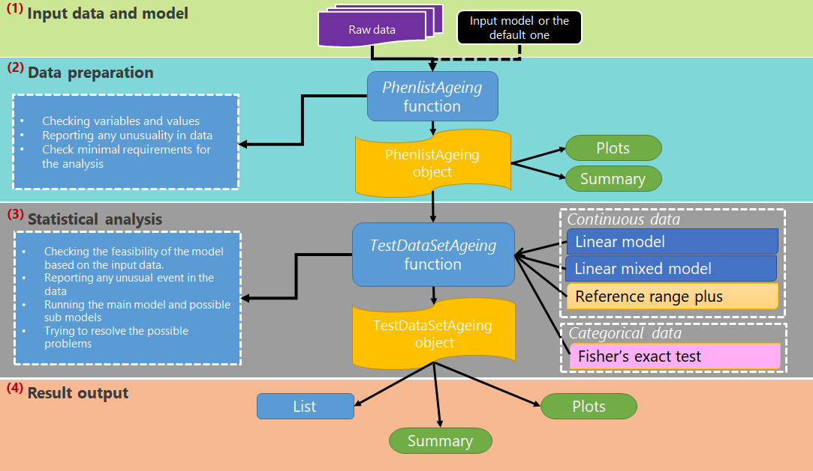

```{r setup, include=FALSE}
knitr::opts_chunk$set(echo = TRUE,results = 'asis')
library(OpenStats)
library(summarytools)
library(nlme)
```


# Introduction

Coping with a large volume of categorical and continuous data in the high-throughput phenotyping pipelines requires a robust automated statistical pipeline that minimal alleviates manual intervention is required.

**OpenStats** provides a variety of the statistical work-flows for the identification of abnormal phenotypes with an emphasize on high-throughput. The embedded set of checks and on-fly fixes assures an accurate and robust analysis for high-throughput data and a comprehensive output allows transferring the results to the downstream stages.

# Package architecture
A schematic illustration of three-layer internal workflows of OpenStats is given below. More details can be found in the appropriate sections of the User’s Guide.



Three first layer allows a dataset as the input and a proper input model. In the second layer, the input data as well as the model are checked for feasibility and correctness and reports any unusuality in the data or the input model. The successful output of this stage is an OpenStatsList object that is the input of the other downstream layer. 

The statistical analysis layer encompasses three analysis framework precisely, Linear Mixed Model and Reference range plus for the continuous and the Fisher's exact test for the categorical data. They are extra checks and on-fly fixes in this stage to assure a successful, correct and comprehensive analysis will be applied to the data. More details are provided in the corresponding section.

The final layer provides feed for the downstream processes and consists of summaries, plots list and JSON objects.


## Input data and model

OpenStats allows a data frame for the input. The input model must be in the standard form of `y~x+z+t+...` no function is allowed in the formula. For instance, `log(y)~x+z+t+..` or `y~x^2+z+t+...` are invalid.

## Data preparation with `OpenStatsList` function

`OpenStatsList` function performs data processing and creates an OpenStats object.
This function allows a data frame as the input so that the rows and columns represent the samples and features respectively. In addition to dependent variable column (the variable of interest) mandatory
column, "Genotype" or the corresponded proxy is required. Note that any other name for "Genotype" is accepted however the OpenStatsList function rename that to "Genotype". To align with **PhenStat** the function allows optional *Sex*, *Batch*, *Weight* (bodyweight) and an extra *LifeStage* in the input parameters.

The main tasks performed by the OpenStats package’s function OpenStatsList are:

* Preparing a working dataset for the downstream operations
* terminology normalisation
* showing a general view of the dataset
* filtering out undesirable records for the input model
* checking whether the dataset can be used for the statistical analysis

All checks are accompanied by informative messages, warnings and errors. One example of the `OpenStatsList` is shown below:


```{r, echo=TRUE}
  ####################################################################
  df = read.csv(system.file("extdata", "test_continuous.csv", package = "OpenStats"))
  ####################################################################
  # OpenStatsList object
  ####################################################################
  OpenStatsList   = OpenStatsList(
      dataset       = df,
      testGenotype  = 'experimental',
      refGenotype   = 'control',
      dataset.colname.batch    = 'date_of_experiment',
      dataset.colname.genotype = 'biological_sample_group',
      dataset.colname.sex      = 'sex',
      dataset.colname.weight   = 'weight'
  )
```

###  Terminology Normalisation

We define "**Terminology Normalisation (TN)**" as the terminology used to describe variables that are essential or commonly used for the statistical analysis of the phenotypic data. The OpenStats package uses the following nomenclature for the names of columns: "Sex", "Genotype", "Batch", "LifeStage" and "Weight" (bodyweight). Besides, unless they are specified in the input of the function, the expected values for

* Sex are "Male" and "Female" 
* LifeStage are "Early" and "Late" 
* and missings are `NA` or `` (Null string).

Note that the essential variable *Genotype* must be specified by the user under `dataset.colname.genotype` and the levels  `testGenotype` and `refGenotype`, and the other parameters are optional. See the example below where the only Genotype is specified and the other parameters left blank

```{r, echo=TRUE}
   OpenStatsListOnlyGenotype   = OpenStatsList(
       dataset       = df,
       testGenotype  = 'experimental',
       refGenotype   = 'control'     ,
       dataset.colname.genotype    = 'biological_sample_group',
       dataset.colname.batch       = NULL,
       dataset.colname.sex         = NULL,
       dataset.colname.weight      = NULL,
       dataset.colname.lifestage   = NULL
   )
```

OpenStatsList function creates a copy of the dataset and then uses internal arguments that help to map columns and values from user’s naming system into the package’s nomenclature. The original file with the dataset stays unchanged since all changes take place internally in `OpenStats` object. 


### PhenList Object
The output of OpenStatsList function is an OpenStats object that contains all the input parameters to the function plus the checked dataset as well as the input dataset.

```{r, echo=FALSE}
   slotNames(OpenStatsList)
```
where the first element (datasetPL) encapsulate the checked and prepared dataset and the last one (datasetUNF) is the untouched input dataset.

### Plot and summaries
The standard `plot` and `summary` function can be applied to an `OpenStats` object. Below shows two examples of continues and categorical data.
```{r, echo=TRUE}
      summary(
         OpenStatsList,
         vars = c('data_point', 'Genotype', 'Sex', 'Batch'),
         style = 'grid'
      )
      plot(OpenStatsList, vars = c('data_point', 'Genotype', 'Sex', 'Batch'))
```


## Statistical Analysis

The OpenStats package provides three frameworks for statistical
analysis: Linear Mixed Models (MM) and Reference Range method (RR) for continuous data, Fisher's Exact Test (FE) for categorical data. In all frameworks, the frameworks allow the custom modelling of the data and the outputs.


### Manager for Analysis Methods – OpenStatsAnalysis function
OpenStack's function `OpenStatsAnalysis` works as a manager for the different statistical analyses methods. It checks the dependent variable, runs the selected statistical analysis framework and returns modelling/testing results in either `OpenStatsMM`, `OpenStatsRR` and `OpenStatsFE` object.

#### Function Arguments
Except for the input data and the framework (MM, RR or FE), the input arguments in `OpenStatsAnalysis` prefixed by the framework name for instance `MM_fixed` only applies to the Linear Mixed Model framework and so are `RR_formula` and `FE_formula`. Some arguments apply in more than one framework. These arguments are prefixed by the concatenation of frameworks such as *FERR* that applies to Fisher's exact test and the Reference range plus frameworks.

### Mixed Model Framework

The linear mixed model framework consists of routines to apply a linear mixed model to the data. The input **fix effects term** must be specified in the standard R formula for instance, `response~Genotype+Sex+Genotype:Sex + Weight` that defines the following statistical model

$$
response = intercept + \beta_1 Genotype + \beta_2 Sex + \beta_3 Genotype*Sex + \beta_4 Weight + e
$$
where $\beta_i, i=1,2,3,4$ are unknown coefficients and the $e$ is the normaly distributed error.

**The random effect term**: This is an optional one-sided formula of the form of `~XX|YY`. For example, `~1|Batch` represents a random intercept model.

**The weight effect**: Not confused with the body weight, it is a part of the estimating $\beta_i$'s. IT is an optional `varFunc` (see R lme manual for more details) object or one-sided formula describing the within-group heteroscedasticity structure. If given as a formula, it is used as the argument to `varFixed`, corresponding to fixed variance weights. See the documentation on `varClasses` for a description of the available `varFunc` classes. If not specified then `varIdent(form = ~ 1 |    LifeStage)` and `varIdent(form = ~ 1 |    Genotype)` if `LifeStage` included in the input data. The former assumes the same variation within the levels of LifeStage/Genotype.

setting the fixed and/or random effect as well as weight effect is enough to run a linear mixed model however OpenStats is capable of applying a model optimisation on the model. Below we explain the optimisation arguments and the steps.


#### Model checks and preparation
OpenStats checks the input mode and the data for the errorneous configurations listed as following

1. the model terms (`MM_fixed`/`MM_random`) exist in data. 
2. OpenStats removes any single level factor from the fixed effect model (`MM_fixed`). 
3. OpenStats checks the interaction term to make sure all interactions have some data attached to them.
4. OpenStats removes duplicated columns in the dataset prior to applying the model.

One can turn the checks 1-3 off by setting TRUE/FALSE in the `MM_checks` argument of the `OpenStatsAnalysis` function.


#### Model optimisation

The first three elements of `MM_optimise` for example `(TRUE, TRUE, TRUE, ...)` apply to the optimisation step of the fixed, weight and random effect respectively. `MM_direction ` controls the direction of the *fixed_effect* optimisation, forward selection (FS), backward elimination (BE) and stepwise (STPW). The forward selection (FS) starts from an intercept and at each step adds more variables. The backward elimination starts from a fully saturated model and at each step removes/keep a variable. In contrast, STPW combines two other methods and add/remove/preserve a variable at each step. 


OpenStats utilises `AICc`, Akaike information criterion (AIC), that has a correction for small sample sizes to perform the mutual comparisons in the model optimisation (selection). AICc is defined by

$$AICc = AIC+\frac{2k^2+2k}{n-k-1}$$
where $k$ and $n$ are the number of parameters and samples respectively and AIC is defined by
$$-2logLikelihood + 2k$$.

Note that OpenStats allows a minimal model for the optimisation (default genotype effect  `~ Genotype + 1`) to prevent eliminating the effects of interest. This is controled by a right-sided formula in `MM_lower`. Further to the fixed effects, OpenStats allows optimisation on the random and the weight effects by comparing the AICc between a model with and without these effects. 


To summerise, the order of optimisation is as follows:

1. Fixed effects
2. weight effect
3. random effect.

Because the AICc only applies to the Maximum Likelihood (ML) estimation of the parameters, all models are first estimated by ML but the final models are reestimated using restricted maximum likelihood method (REML) that is proven a better fit of the model. 

The example below fits an optimised linear mixed model to the data:

```{r eval=FALSE, echo=TRUE}
MM_result = OpenStatsAnalysis(
   OpenStatsList = OpenStatsList ,
   method        = 'MM'          ,
   MM_fixed      = data_point ~ Genotype  + Sex + Genotype:Sex,
   MM_random     = ~ 1 | Batch                                ,
   MM_weight     = varIdent(form = ~ 1 | Genotype)            ,
   MM_lower      = ~ 1 + Genotype                             ,
   MM_direction  = 'both'                                     ,
   MM_optimise   = c(TRUE, TRUE, TRUE, FALSE, FALSE, FALSE)
)
```

### Sub-model estimation
OpenStat can be used to derive submodels from the input model, called *Split model effects*. This is mainly useful for reporting the sex/age-specific effects. This is performed by creating submodels of the full model. For instance for the input fixed effect model, `response~Genotype+Sex+Weight` a possible submodel is `response~Sex+Sex:Genotype + Weight`. This model is then estimated under the configuration of the optimal model.  One can turn off Split model effects by seeting the fouth element of `MM_optimise` to `FALSE.`
### Effect size and percentage change  
OpenStats estimates the normalised effect size for each effect in the (input) fixed effects. This is performed by normalising the data and following the steps below

* for the  categorical variables such as Sex or Genotype etc.
    * fit the sub model $response=\beta_0+\beta_1 VariableOfInterest+e$ under the optimal model configuration and estimate the standard deviation of the residuals, $\sigma_e$
    * calculate the max absolute distance (MAD) of the mean of response under each level of the reponse e.g.mean response for the control and the threatment group
    * estimate the effect size by $MAD/\sigma_e$
* for the continuous variables such as body weight
    * fit the sub model $response=\beta_0+\beta_1 VariableOfInterest+e$ under the optimal model configuration
    * report $\beta_1$ as the effect size
    
    
The percentage change for all variables (categorical and continues) are estimated as below

* fit the sub model $response=\beta_0+\beta_1 VariableOfInterest+e$ under the optimal model configuration
* find the range of the ransponse variable $r=max_{\text{response variable}} - min_{\text{response variable}}$
* calculate the percent change by $\beta_1/r$

Note that one can exclude the calculation of the effect sizes and percentage changes by setting the fifth element of `MM_optimise` to `FALSE.`

### Quality test
Further to some visualisation tools, OpenStats tests the normality of the residulas from the optimised model for all levels of the explanatory variables. The example below shows the output of the normality test:

```{r include=FALSE}
MM_result = OpenStatsAnalysis(
   OpenStatsList = OpenStatsList ,
   method        = 'MM'          ,
   MM_fixed      = data_point ~ Genotype  + Sex + Genotype:Sex,
   MM_random     = ~ 1 | Batch                                ,
   MM_weight     = varIdent(form = ~ 1 | Genotype)            ,
   MM_lower      = ~ 1 + Genotype                             ,
   MM_direction  = 'both'
)
```
```{r echo=FALSE}
o = sapply(names(MM_result$output$ResidualNormalityTests), function(x) {
   message('Variable: ', x)
   if (x != 'Overall')
      message('\t\t levels: ', paste(
         names(MM_result$output$ResidualNormalityTests[[x]]),
         collapse = ', '
      ))
})
rm(o)
```

It is also possible to diagnoise the goodness of fits by `plot` and `summary` functions. Below shows an example of the these two functions. 

```{r echo=TRUE}
summary(MM_result, format = 'markdown')
plot(MM_result)
```

### Notes, messages and warnings
OpenStats is design to report each step in a consise but informative way. All fatal errors are stored in a placeholder names `messages` in the final output. The minor errors and warnings are reported. OpenStatsAnalysis is capable of fixing some already known conditions that could lead to a fatal error. For example if the random effect is the cause of the error, then OpenStats removes the term. The same is for any of the non-essential fix effects. One could turn off all reportings by setting `debug=FALSE`.

Example below show the example of the MM framework:

```{r eval=TRUE, echo=TRUE}
MM_result = OpenStatsAnalysis(
   OpenStatsList = OpenStatsList ,
   method        = 'MM'          ,
   MM_fixed      = data_point ~ Genotype  + Sex + Genotype:Sex,
   MM_random     = ~ 1 | Batch                                ,
   MM_weight     = varIdent(form = ~ 1 | Genotype)            ,
   MM_lower      = ~ 1 + Genotype                             ,
   MM_direction  = 'both'                                     ,
   MM_optimise   = c(TRUE, TRUE, TRUE, TRUE, TRUE, TRUE)   ,
   debug         = TRUE  
)
```

```{r pressure, echo=FALSE}
message(1:10)
message(1:10)

```

Note that the `echo = FALSE` parameter was added to the code chunk to prevent printing of the R code that generated the plot.
