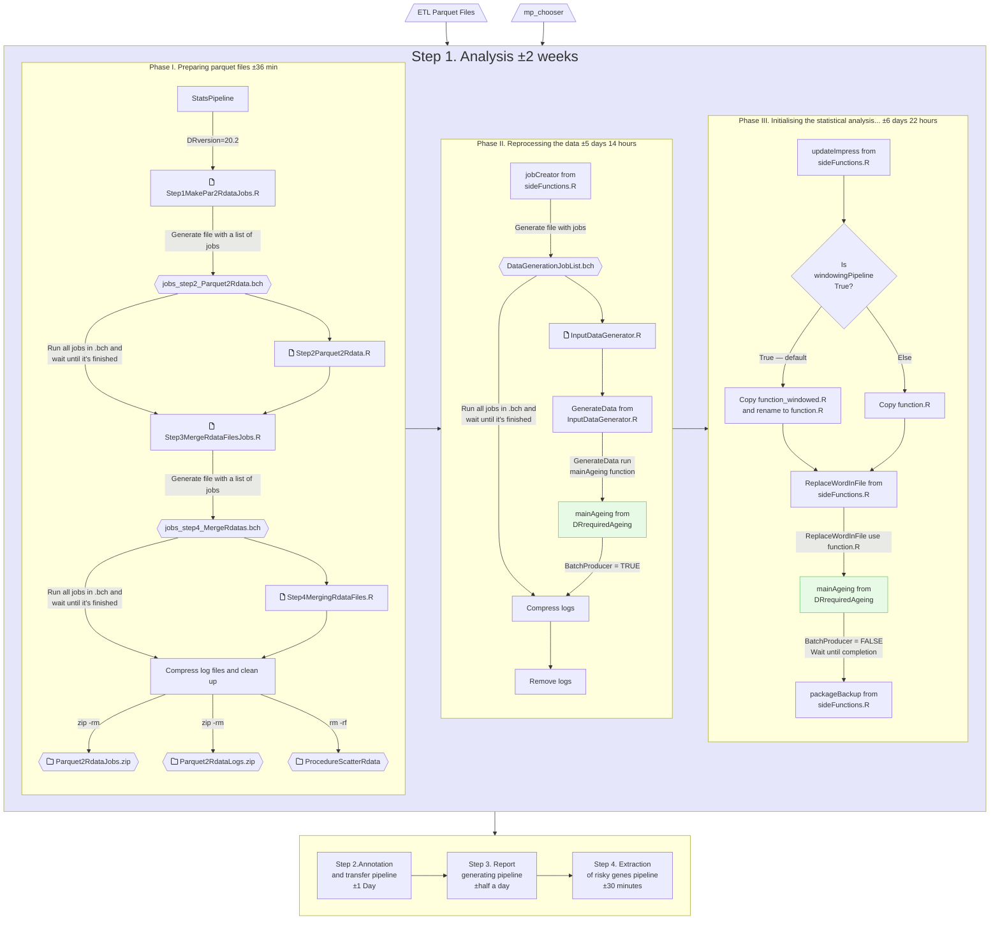

# IMPC Statistical Pipeline
This is the main R source code repository for IMPC statistical pipeline.

The IMPC statistical pipeline requires 4 steps to complete:
1. Pre-processing the data and run the analysis.
2. Run the annotation and transfer pipeline.
3. Run the report generating pipeline with.
4. Run the extraction of risky genes pipeline. 


# How to run IMPC Statistical Pipeline
Instructions are made for release 20.2.

## Step 1. Data Preprocessing and Analysis
### Preparation
0. We work under mi_stats virtual user:
`become mi_stats`

1. Create working directory.
```console
mkdir --mode=775 /homes/mi_stats/IMPC_StatsPipeline/IMPC_DRs/stats_pipeline_input_dr20.2
cd /homes/mi_stats/IMPC_StatsPipeline/IMPC_DRs/stats_pipeline_input_dr20.2
```

2. Copy the input parquet files (±80*10^6 data points) and mp_chooser_json.
```console
cp /nfs/production/tudor/komp/data-releases/latest-input/dr20.0/output/flatten_observations_parquet/*.parquet ./
cp /nfs/production/tudor/komp/data-releases/latest-input/dr20.0/output/mp_chooser_json/part-*.txt ./
```
We copied files from 20.0 release, but next time the location of the input files could differ.<br>
According to [Observations Output Schema](https://github.com/mpi2/impc-etl/wiki/Observations-Output-Schema) some fields hava array data type. However in current dataset those fields, instead of being array, are comma-separated lists.

3. Convert JSON mp_chooser file to Rdata.
```console
R
a = jsonlite::fromJSON('part-*.txt');save(a,file='mp_chooser_20230411.json.Rdata')
q()
```
**Note:** we kept the name of the mp_chooser file exactly as mp_chooser_20230411.json.Rdata, because it is used on the code.

4. Clone impc_stats_pipeline repository.
```console
cd /tmp
git clone https://github.com/mpi2/impc_stats_pipeline.git
```

5. Update mp_chooser file in several directories.
```console
cp ~/IMPC_StatsPipeline/IMPC_DRs/stats_pipeline_input_dr20.2/mp_chooser_20230411.json.Rdata /tmp/impc_stats_pipeline/Late\ adults\ stats\ pipeline/DRrequiredAgeing/DRrequiredAgeingPackage/inst/extdata/annotation/
cp ~/IMPC_StatsPipeline/IMPC_DRs/stats_pipeline_input_dr20.2/mp_chooser_20230411.json.Rdata /tmp/impc_stats_pipeline/Late\ adults\ stats\ pipeline/DRrequiredAgeing/DRrequiredAgeingPackage/inst/extdata/StatsPipeline/jobs/Postgres
```

6. Update master branch of the repository on GitHub with the new version of mp_chooser.
```console
git add mp_chooser_20230411.json.Rdata
git commit -m "Replace an mp_chooser"
git push origin master
```
**Note:** Login with [credentials](https://www.ebi.ac.uk/seqdb/confluence/display/MouseInformatics/GitHub+Machine+User) using personal access token for impc-stats-pipeline repo.

7. Update packages to the latest version.
```console
cd /nfs/production/tudor/komp/impc_statistical_pipeline/IMPC_DRs/stats_pipeline_input_dr20.2
R
source('https://raw.githubusercontent.com/mpi2/impc_stats_pipeline/master/Late%20adults%20stats%20pipeline/DRrequiredAgeing/DRrequiredAgeingPackage/inst/extdata/StatsPipeline/UpdatePackagesFromGithub.R')
q()
```

### Run Statistical Pipeline
8. Start screen.
```console
cd ~
screen -S stats-pipeline
bsub -Is -q long bash
cd /nfs/production/tudor/komp/impc_statistical_pipeline/IMPC_DRs/stats_pipeline_input_dr20.2
```

9. Run statistical pipeline.
```console
R
DRrequiredAgeing:::StatsPipeline(DRversion=20.2)
```
- To leave screen press combination `Ctrl + A + D`.
- Don't forget to write down the number that will appear after leaving the screen, for example, 3507472, and number of cluster node.

10. Check progress with this commands as an example.
- To log in on specific node: 
`ssh codon-login-01`
- Activate screen to check progress:
`screen -r 3507472.stats-pipeline`

## Step 2. Run Annotation Pipeline
The `IMPC_HadoopLoad` command uses the power of LSF cluster to assign the annotations to the StatPackets and transfers the files to the Hadoop cluster. The files will be transferred to Hadoop:/hadoop/user/mi_stats/impc/statpackets/DRXX.
```console
q()
cd /nfs/production/tudor/komp/impc_statistical_pipeline/IMPC_DRs/stats_pipeline_input_dr20.2/SP/jobs/Results_IMPC_SP_Windowed
R
DRrequiredAgeing:::IMPC_HadoopLoad(prefix='DR20.2',transfer=FALSE)
```
- The most complex part of this process is that some files will fail to transfer and you need to use scp command to transfer files to the Hadoop cluster manually.
- When you are sure that all files are there, you can share the path with Federico.
**Note**: in the slides transfer=TRUE, which means we haven't transfered files this time. 

## Step 3. Run the Report generating Pipeline
This process generates statistical reports typically utilized by the IMPC working groups. 
1. Navigate to `/nfs/production/tudor/komp/impc_statistical_pipeline/IMPC_DRs/stats_pipeline_input_drXX.y/SP/jobs/Results_IMPC_SP_Windowed`
2. Allocate a high memory machine on cluster and initialise an interactive shell: 
`bsub –M 300000 –e errReportGeneratingPipeline –o outReportGeneratingPipeline –Is /bin/bash`
3. The commands below will generate two CSV files in the `/nfs/production/tudor/komp/impc_statistical_pipeline/IMPC_DRs/stats_pipeline_input_drXX.y/SP/jobs/Results_IMPC_SP_Windowed` directory for the unidimentional and categorical results. The files can be gzip and moved to the FTP directory. You can decorate and format the files by using one of the formatted files in the previous data releases.
```console
R
DRrequiredAgeing:::IMPC_statspipelinePostProcess()
DRrequiredAgeing:::ClearReportsAfterCreation()
```

## Step 4. Run the Extraction of Risky Genes Pipeline
This process generates a list of risky genes to check manually.
1. Allocate a machine on codon cluster: `bsub –M 8000 –Is /bin/bash`
2. Open an R session: `R`
3. Run the following command in the console: `DRrequiredAgeing:::extractRiskyGenesFromDRs('path to the gzip report from the NEW release','path to the new report on the OLD release')`
- You may need to transfer the old reports to a path to make it accessible for the pipeline.
- The output of this process is a file `RiskyGenesToCheck_[DATE].txt` in the current directory with each line a gene that should be manually checked.

# FAQ
- ***When will the pipeline be completed?***<br>
When there are no jobs running under the mi_stats user.<br><br>
- ***Do you expect any errors from the stats pipeline?***<br>
Yes, having a few errors is normal. If you observe more than a few errors, you may want to run the GapFilling pipeline. Refer to the Step_1.2_RunGapFillingPipeline.mp4 [video](https://www.ebi.ac.uk/seqdb/confluence/display/MouseInformatics/How+to+run+the+IMPC+statistical+pipeline). Make sure to log in to Confluence first.<br><br>
## Step 1 FAQ
- ***How can you determine on step 1 if the pipeline is still running?***<br>
The simplest method is to execute the `bjobs` command. During the first 4 days of running the pipeline, there should be less than 20 jobs running. Otherwise, there should be 5000+ jobs running on the codon cluster.<br><br>
- ***How to determine if step 1 is finished?***<br>
When there are no jobs running in the cluster, it indicates that the pipeline has been completed.<br><br>
- ***How to retrieve logs from the pipeline step 1?***<br>
    - The short answer: The simplest method is to check the `<stats pipeline directory>/SP/logs` directory after the pipeline completes.
    - Long answer (applicable if the pipeline fails during execution): Log files are distributed for individual jobs and are not located in a single directory. To consolidate the log files into a destination directory, you can use the following commands in bash."
```console
cd <stats pipeline directory>/SP
find ./*/*_RawData/ClusterOut/ -name *ClusterOut -type f  |xargs cp --backup=numbered -t <path to a log directory>
find ./*/*_RawData/ClusterErr/ -name *ClusterErr -type f  |xargs cp --backup=numbered -t <path to a log directory>
```
- ***When should you run the gap filling pipeline after completing step 1?***<br>
In very rare cases, the stats pipeline may fail for unknown reasons.To resume the pipeline from the point of failure, you can use the GapFilling Pipeline. This is equivalent to running the pipeline by navigating to `<stats pipeline directory>/SP/jobs` and executing `AllJobs.bch`. Before doing so, make sure to edit function.R and set the parameter `onlyFillNonExistingResults` to TRUE. After making this change, run the pipeline by executing `./AllJobs.bch` and wait for the pipeline to fill in the missing analyses. Please note that this process may take up to 2 days.<br><br>

## Step 2 Annotation Pipeline FAQ
- ***How to determine if the annotation pipeline has finished?***<br>
Verify that there are no running jobs on the cluster.<br><br>
- ***Where are files located on the Hadoop cluster? (Provide the path to Federico)***<br>
They are in directory YYY [a date in dmyyyy format]<br>
YYY: Hadoop:`/hadoop/user/mi_stats/impc/statpackets/DRXX.YY/`<br><br>
- ***How can one determine if a file has not been successfully transferred to the Hadoop cluster??***<br>
If a file is located in the DDD directory and is in a gzipped format, it can be considered as successfully transferred.<br>
DDD: Codon:`nfs/production/tudor/komp/impc_statistical_pipeline/IMPC_DRs/stats_pipeline_input_drXX.YY/SP/jobs/Results_IMPC_SP_Windowed/AnnotationExtractorAndHadoopLoader/tmp`<br><br>
- ***How can I transfer files that have failed into Hadoop?***<br>
    - First navigate to DDD: `cd DDD`<br>
    - Move the non-gzipped files to YYY using SCP command. Alternatively, if you are using R and have an R session open in the `DDD` directory, you can run the following R command: `DRrequiredAgeing:::HadoopReTransferSCP(prefix=‘DRXX.YY/tmpDir’)`<br>
    - This command will clean up all .gz files (which were already successfully transferred) from the directory and transfer the remaining files into a directory named `tmpDir` on Hadoop.<br>
    - After the transfer, move the files from `tmpDir` into the 'YYY' directory. It's important to note that the Hadoop HDFS does not allow rewriting files. If the file already exists in the target directory `YYY`, the process will fail. Hence, the intermediate step of transferring to `tmpDir` is essential to avoid conflicts.
