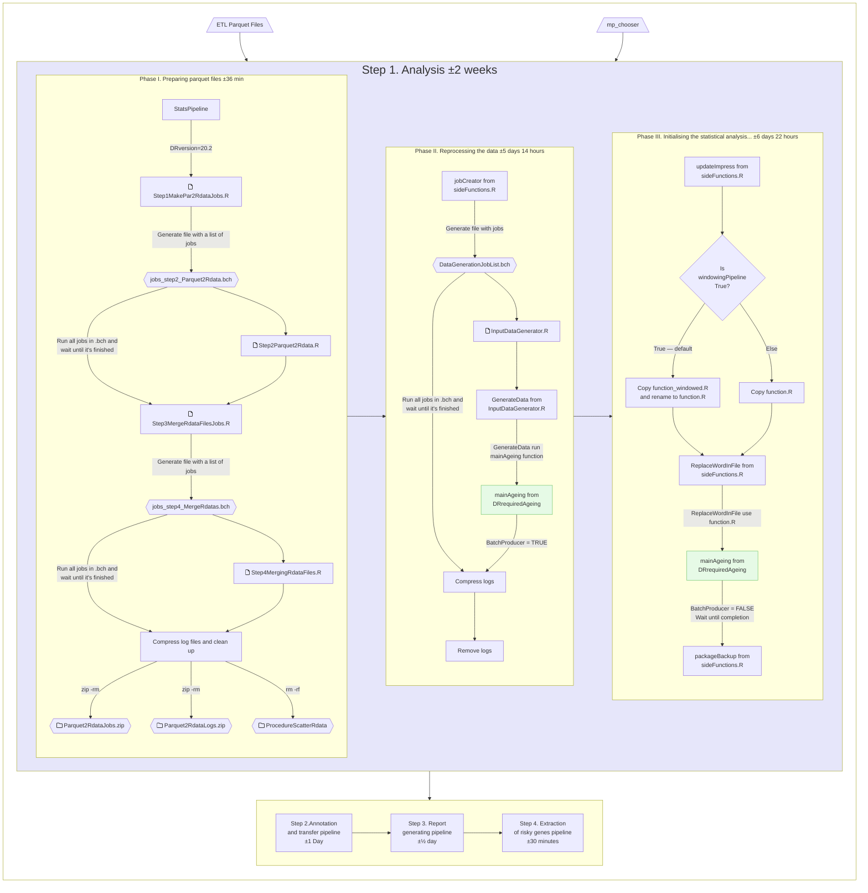

# IMPC Statistical Pipeline
This is the main R source code repository for IMPC statistical pipeline.

The IMPC statistical pipeline requires 2 steps to complete:
1. Pre-processing the data and run the statistical analysis.
2. Run the annotation pipeline.


# How to Run IMPC Statistical and Annotation Pipeline
These instructions are tailored for Release 21.0. To know more about input files for statistical pipeline refer to the [Observations Output Schema](https://github.com/mpi2/impc-etl/wiki/Observations-Output-Schema). In the current dataset, some fields that should be arrays are presented as comma-separated lists.

## Step 1. Data Preprocessing and Analysis
### 0. Switch to the mi_stats virtual user, start screen and activate working environment called R2D2
```console
become mi_stats
screen -S stats-pipeline
conda deactivate
conda activate R2D2
```

### 1. Set necessary variables
```console
export VERSION="21.0"
export REMOTE="mpi2"
export BRANCH="master"
export KOMP_PATH="<absolute_path_to_directory>"
```

### 2. Download script `orchestration.sh` that run both statistical and annotation pipeline on SLURM and add execute permission to a file
```console
cd ${KOMP_PATH}/impc_statistical_pipeline/IMPC_DRs/orchestration_scripts
wget https://raw.githubusercontent.com/${REMOTE}/impc_stats_pipeline/${BRANCH}/orchestration/orchestration.sh -O ${VERSION}_orchestration.sh
chmod +x ${VERSION}_orchestration.sh
```

### 3. Execute `orchestration.sh` script
```console
bash ${VERSION}_orchestration.sh ${VERSION} ${REMOTE} ${BRANCH} ${KOMP_PATH} ${KOMP_PATH}/data-releases/latest-input/dr${VERSION}/output/flatten_observations_parquet/ ${KOMP_PATH}/data-releases/latest-input/dr${VERSION}/output/mp_chooser_json/
```
- To leave screen, press combination `Ctrl + A + D`. Save screen session name, for example `3773511.stats-pipeline`. You will need it to reattach to the screen.
- You can track progress in the `${KOMP_PATH}/impc_statistical_pipeline/IMPC_DRs/stats_pipeline_logs/orchestration_${VERSION}.log` file or reattach to the screen with following command.
```console
screen -r 3773511.stats-pipeline
```

**Note:** Be cautious, the location of the input files may vary.
To execute `orchestration.sh` we need to pass six parameters:

  1. Version of the data release.
  2. Remote name.
  3. Branch name.
  4. Path to the initial directory.
  5. Path to the input parquet files.
  6. Path to the MP chooser file.

Seventh parameter is optional and by default is true. It indicates whether to use windowing or not. 

### Monitor progress using the following commands
- Use `squeue` to check list of running jobs.
- Use `jobinfo -v <job_id>` to check the job status.
- Review the log files:
```console
less ${KOMP_PATH}/impc_statistical_pipeline/IMPC_DRs/stats_pipeline_logs/stats_pipeline_${VERSION}.log
less ${KOMP_PATH}/impc_statistical_pipeline/IMPC_DRs/stats_pipeline_logs/stats_pipeline_${VERSION}.err
```
