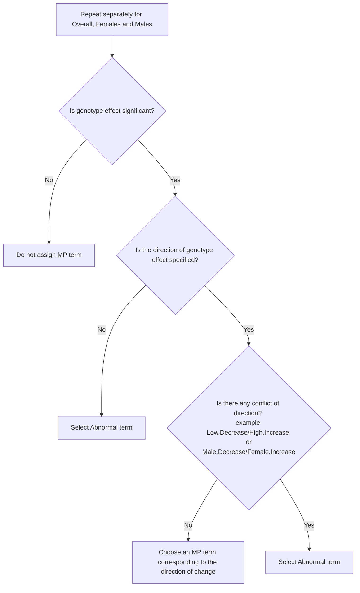

# IMPC Annotation Pipeline
The IMPC annotation pipeline assigns Mammalian Phenotype (MP) terms to significant genetic effects based on a p-value threshold of 0.0001. The goal is to associate phenotypic observations with the corresponding genetic modifications.
At the IMPC, genetic effects are identified using three statistical analysis platforms:
1. Linear Mixed Model framework or MM
2. Fisher's Exact Test framework or FE
3. Reference Range Plus Test framework or RR

## Continuous data
Continuous data are typically analysed using a linear mixed model framework. These continuous measurements are particularly informative because the direction of change can be determined through the effect size.

However, due to the complexity of the data, not all continuous variables can be analysed using this framework. In such cases, the IMPC often employs the Reference Range Plus (RR) method. Control data are first discretising into three categories: low, normal, and high. Mutant data points are then classified into one of these reference categories. Finally, a Fisher's Exact Test is applied to determine whether there is a statistically significant deviation from the normal category.

## Categorical data 
Categorical data in the IMPC encompasses a range of qualitative measurements and is analysed using Fisher’s Exact Test, as implemented in the R package OpenStats.

# How IMPC Annotation Pipeline Works
The `annotationChooser` function is processes statistical analysis results called statpacket. It determines calls based on significance levels. These calles are then mapped to Mammalian Phenotype (MP) ontology terms using a provided `mp_chooser_file`. Finally, it updates the input statpacket's JSON component with the identified MP terms. If no relevant annotation is found or the statistical result is not significant, it returns the original statpacket with no MP terms added.

The annotation pipeline requires a reference table that summarises the available MP terms for a given IMPC parameter. This reference can be retrieved from [IMPReSS](https://www.mousephenotype.org/impress/index).
The ETL pipeline handles this by generating the `mp_chooser.json` file.

