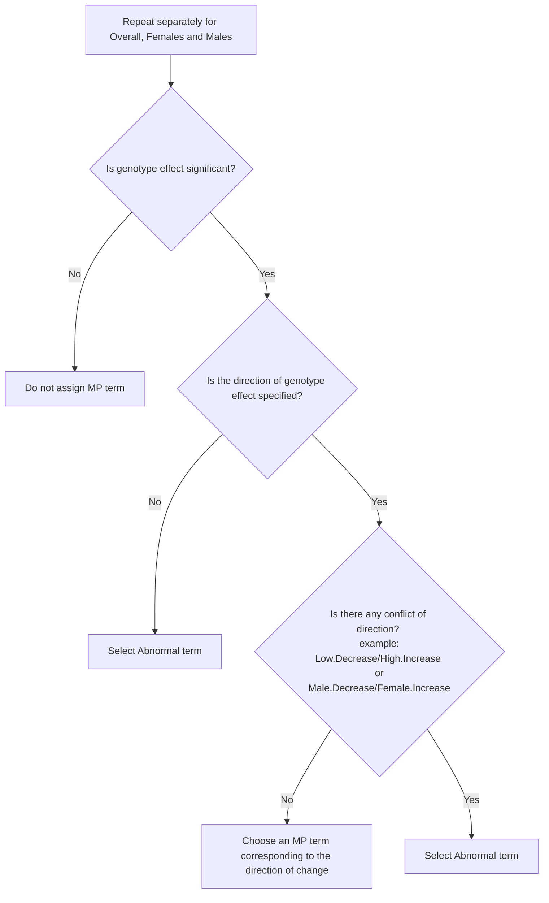

```mermaid
%%{
    init: {
        "theme": "default",
        "themeVariables": {
            "fontSize": "15px"
        },
        "sequence": {
            "useMaxWidth": false
        }
    }
}%%
graph TD;
    A[Repeat separately for Overall, Females and Males] --> B{Is genotype effect significant?}
    B -- No --> C[Do not assign MP term]
    B -- Yes --> D{Is the direction of genotype effect specified?}
    D -- No --> E[Select Abnormal term]
    D -- Yes --> F{Is there any conflict of direction? <br> example: Low.Decrease/High.Increase <br> or Male.Decrease/Female.Increase}
    F -- No --> G[Choose an MP term corresponding to the direction of change]
    F -- Yes --> H[Select Abnormal term]
```