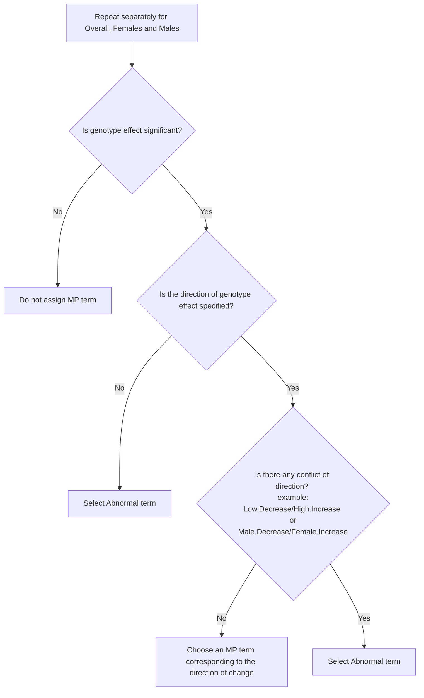

# IMPC Annotation Pipeline
The IMPC annotation pipeline assigns Mammalian Phenotype (MP) terms to significant genetic effects based on a p-value threshold of 0.0001. The goal is to associate phenotypic observations with the corresponding genetic modifications.
At the IMPC, genetic effects are identified using three statistical analysis platforms:
1. Linear Mixed Model framework or MM
2. Fisher Exact Test framework or FE
3. Reference Range Plus Test framework or RR

